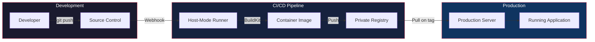
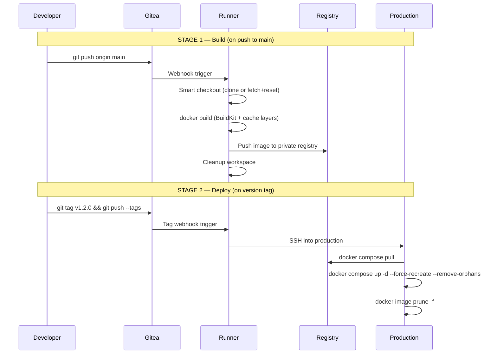
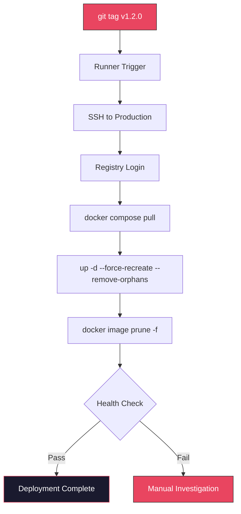

# RedCup GitOps Factory

A self-hosted CI/CD pipeline delivering **push-to-deploy** functionality without external dependencies. Code goes from commit to production through an entirely private infrastructure — no GitHub Actions, no CircleCI, no third-party services.

Built for developers and small teams who want full ownership of their build and deployment pipeline.

---

## Features

- **Fully self-hosted** — source control, CI/CD runner, container registry, and deployment
- **Two-stage pipeline** — build on push, deploy on tag
- **Dormant by design** — runners stay idle until repos explicitly opt in
- **Zero external dependencies** — no third-party CI/CD services required
- **BuildKit caching** — inline cache layers for faster rebuilds
- **Organization-level secrets** — credentials managed centrally, never in repo code
- **Stateless production** — deployment targets hold no source code or build artifacts
- **Smart checkout** — handles both fresh clones and workspace reuse automatically

---

## Architecture



### Two-Stage Pipeline



---

## How It Works

### Opt-In Builds

Repositories opt into the pipeline by including workflow files. No workflow = no builds. This prevents accidental builds and conserves resources.

```
Infrastructure provides capability.
Repositories provide intent.
```

### Build Stage (`build.yaml`)

Triggered on every push to `main`:

```yaml
name: Build
on:
  push:
    branches: [main]

jobs:
  build:
    runs-on: redcup-linux:host
    steps:
      - name: Smart Checkout
        run: |
          if [ -d ".git" ]; then
            git fetch origin main
            git reset --hard origin/main
          else
            git clone $REPO_URL .
          fi

      - name: Build Image
        env:
          DOCKER_BUILDKIT: "1"
        run: |
          docker build \
            --cache-from $REGISTRY/$IMAGE:latest \
            --build-arg BUILDKIT_INLINE_CACHE=1 \
            -t $REGISTRY/$IMAGE:latest .

      - name: Push to Registry
        run: |
          echo "${{ secrets.TOKEN_GITEA }}" | docker login $REGISTRY -u deploy-bot --password-stdin
          docker push $REGISTRY/$IMAGE:latest
```

### Deploy Stage (`deploy.yaml`)

Triggered only on version tags:

```yaml
name: Deploy
on:
  push:
    tags: ['v*']

jobs:
  deploy:
    runs-on: redcup-linux:host
    steps:
      - name: Install SSH Key
        run: |
          mkdir -p ~/.ssh
          echo "${{ secrets.SERVER_SSH_KEY }}" > ~/.ssh/deploy_key
          chmod 600 ~/.ssh/deploy_key

      - name: Deploy to Production
        run: |
          ssh -i ~/.ssh/deploy_key -o StrictHostKeyChecking=no \
            ${{ secrets.PROD_USER }}@${{ secrets.PROD_HOST }} << 'DEPLOY'
              cd /data/production/$APP
              docker login $REGISTRY -u deploy-bot -p $TOKEN
              docker compose pull
              docker compose up -d --force-recreate --remove-orphans
              docker image prune -f
          DEPLOY
```

---

## Design Principles

| Principle | Implementation |
|-----------|---------------|
| Dormant by Design | Runners activate only when workflow files exist in a repo |
| Infrastructure =/= Intent | Infrastructure provides capability; repos define what gets built |
| Two-Stage Separation | Build and deploy are independent workflows — build is automatic, deploy is intentional (tag) |
| Smart Checkout | Handles workspace reuse without stale state — fetch+reset or fresh clone |
| Cache Forward | BuildKit inline cache reduces rebuild times by reusing unchanged layers |
| Secret Isolation | Org-level secret injection — developers never see production credentials |
| Stateless Targets | Production servers pull containers, hold no source code |
| Clean Deploys | `--force-recreate --remove-orphans` ensures no stale containers survive |

---

## Runner Configuration

The runner operates in **host mode** (bare-metal), not containerized. This gives it direct access to the Docker daemon for building images.

| Setting | Value |
|---------|-------|
| Binary | act_runner |
| Mode | Host (bare-metal) |
| Service | systemd managed |
| Label | `redcup-linux:host` |
| Build tool | Docker with BuildKit |

### Runner Health Checks

```bash
# Check runner service status
systemctl status act_runner_host

# View runner logs
journalctl -u act_runner_host -f

# Verify runner registration
curl -s http://localhost:3000/api/v1/repos/search | head
```

---

## Secrets

All secrets are injected at the organization level in Gitea. Individual repos never store credentials.

| Secret | Scope | Purpose |
|--------|-------|---------|
| `TOKEN_GITEA` | Registry auth | `write:packages` scope — push images to registry |
| `SERVER_SSH_KEY` | Deployment | Ed25519 key for SSH into production |
| `PROD_HOST` | Deployment | Production server address |
| `PROD_USER` | Deployment | SSH username on production |

---

## New Repository Checklist

When onboarding a new application:

1. Create repo in Gitea
2. Add `.gitea/workflows/build.yaml`
3. Add `.gitea/workflows/deploy.yaml`
4. Verify runner label matches (`redcup-linux:host`)
5. Add `Dockerfile` to repo root
6. Verify org-level secrets are accessible
7. Ensure registry is configured as insecure in Docker daemon
8. Create production directory on target server
9. Add `docker-compose.yml` to production directory
10. Test build: push to `main`, verify image appears in registry
11. Test deploy: push a `v0.0.1` tag, verify container starts
12. Verify health endpoint responds

---

## Deployment Flow



---

## Troubleshooting

### Runner Not Picking Up Jobs

```bash
# Check service status
systemctl status act_runner_host

# Check label mismatch — must be redcup-linux:host
# If workflows use ubuntu-latest or redcup-host, they won't match

# Hard reset if stale state
systemctl stop act_runner_host
# Clear stale Docker volumes
docker volume prune -f
systemctl start act_runner_host
```

### Registry 401 Errors

Verify the service bot account has `write:packages` scope. Runner and registry must use the same `TOKEN_GITEA` credential.

### Build Cache Not Working

Ensure `DOCKER_BUILDKIT=1` is set in the workflow environment. Without it, `--cache-from` and inline cache are ignored.

### Stale Containers After Deploy

The deploy step uses `--force-recreate --remove-orphans` + `docker image prune -f`. If stale containers persist, check for containers not managed by the compose file:

```bash
docker ps -a --filter "status=exited"
```

### Emergency Manual Deploy

If the pipeline is down, deploy manually via SSH:

```bash
ssh user@production-host
cd /data/production/<app>
docker login <registry> -u deploy-bot -p <token>
docker compose pull
docker compose up -d --force-recreate --remove-orphans
docker image prune -f
```

---

## Limitations

- Single-target deployment (no multi-region orchestration)
- No built-in approval gates (all tagged commits deploy automatically)
- No automated health check in deploy stage (manual verification required)
- Runner recovery requires manual restart after host reboots
- Registry runs over HTTP (suitable for internal networks only)

---

## License

MIT
